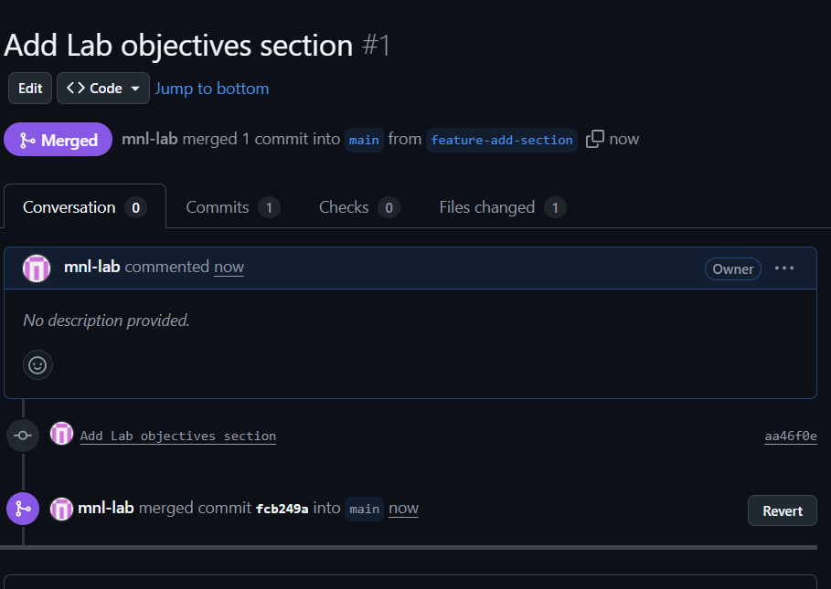
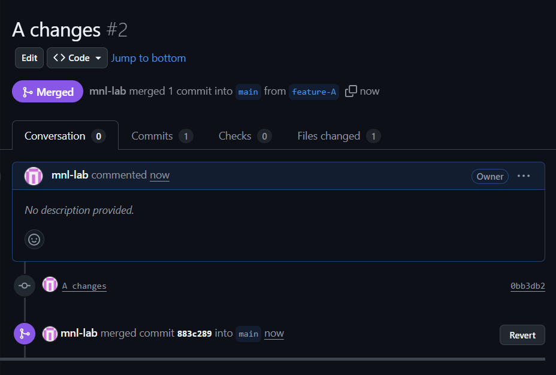
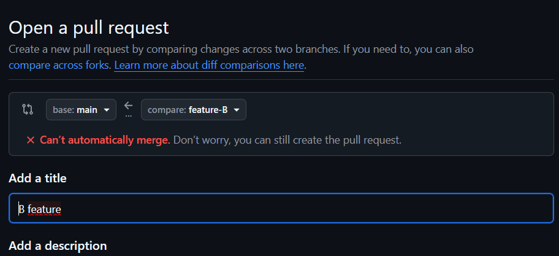
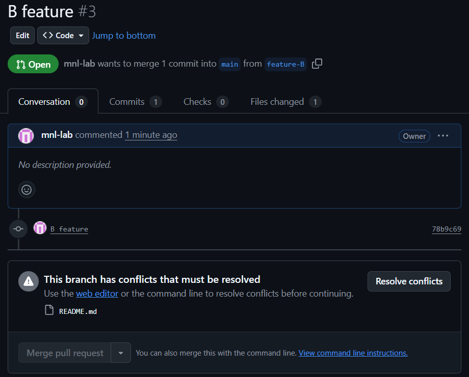
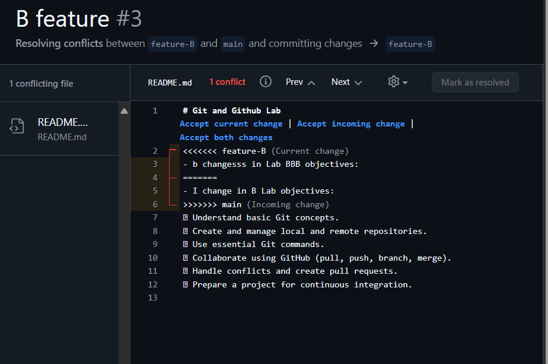
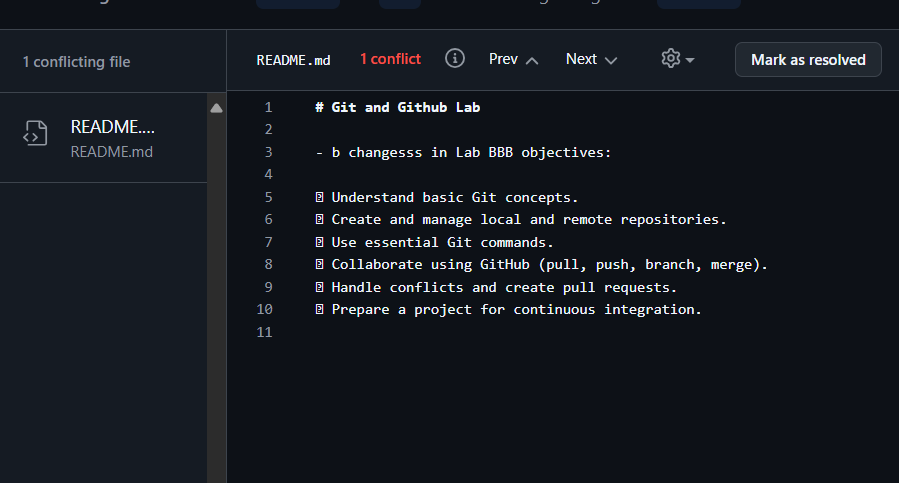
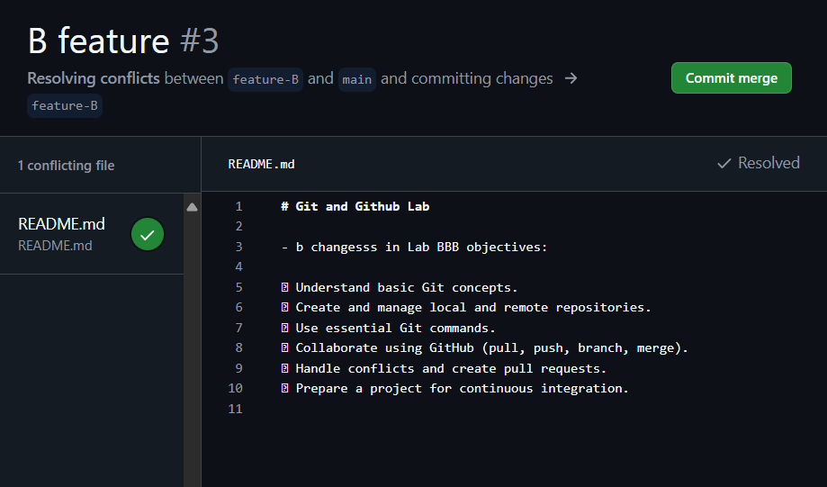
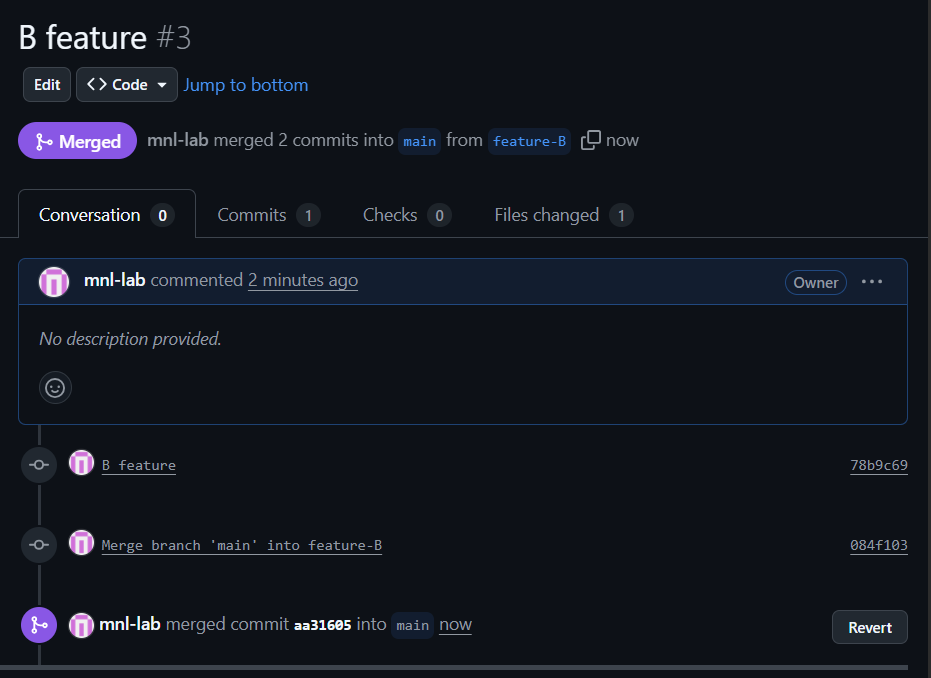

# Tp 5 report

## Exercise 1
- checking installation and configuring identity
```powershell
PS C:\Users\utilisateur> git version
git version 2.51.0.windows.2
PS C:\Users\utilisateur> git config --global user.name "mnl"
PS C:\Users\utilisateur> git config --global user.email "manalzaidi2005@gmail.com"
```
- creating a local repository
```bash
mnl@PC2656:/mnt/c/Users/utilisateur/s5/swe/code/tp5$ cd tp-git
mnl@PC2656:/mnt/c/Users/utilisateur/s5/swe/code/tp5/tp-git$ git init
hint: Using 'master' as the name for the initial branch. This default branch name
hint: is subject to change. To configure the initial branch name to use in all
hint: of your new repositories, which will suppress this warning, call:
hint:
hint:   git config --global init.defaultBranch <name>
hint:
hint: Names commonly chosen instead of 'master' are 'main', 'trunk' and
hint: 'development'. The just-created branch can be renamed via this command:
hint:
hint:   git branch -m <name>
Initialized empty Git repository in /mnt/c/Users/utilisateur/s5/swe/code/tp5/tp-git/.git/
```
- creating README file and committing changes
```bash
/tp-git/.git/
mnl@PC2656:/mnt/c/Users/utilisateur/s5/swe/code/tp5/tp-git$ echo "# Git and Github Lab" > README.md
mnl@PC2656:/mnt/c/Users/utilisateur/s5/swe/code/tp5/tp-git$ git add README.md
mnl@PC2656:/mnt/c/Users/utilisateur/s5/swe/code/tp5/tp-git$ git commit -m "Initial commit: add README"
[master (root-commit) f841356] Initial commit: add README
 Committer: mnl-lab <mnl@PC2656.localdomain>
Your name and email address were configured automatically based
on your username and hostname. Please check that they are accurate.
You can suppress this message by setting them explicitly:

    git config --global user.name "Your Name"
    git config --global user.email you@example.com

After doing this, you may fix the identity used for this commit with:

    git commit --amend --reset-author

 1 file changed, 1 insertion(+)
 create mode 100644 README.md
 ```
 -> What does git init do? 
- `git init` initializes a new Git repository in the current directory. It creates a hidden `.git` folder that contains all the necessary metadata and version control information for the repository.
-> What is stored inside the .git folder?
- The `.git` folder contains various subdirectories and files that store the repository's configuration, commit history, branches, tags, and other essential data required for version control operations. Key components include:
  - `HEAD`: Points to the current branch reference.
  - `config`: Contains repository-specific configuration settings.
  - `objects/`: Stores all the content of the files and commits in a compressed format.
  - `refs/`: Contains references to branches and tags.
  - `index`: Staging area for changes before committing.

## Exercise 2
- connecting to remote repository
```bash
mnl@PC2656:/mnt/c/Users/utilisateur/s5/swe/code/tp5/tp-git$ git remote add origin https://github.com/mnl-lab/tp-git.git
mnl@PC2656:/mnt/c/Users/utilisateur/s5/swe/code/tp5/tp-git$ git branch -M main
mnl@PC2656:/mnt/c/Users/utilisateur/s5/swe/code/tp5/tp-git$ git push -u origin main
Username for 'https://github.com': mnl-lab
Password for 'https://mnl-lab@github.com':
Enumerating objects: 3, done.
Counting objects: 100% (3/3), done.
Writing objects: 100% (3/3), 244 bytes | 13.00 KiB/s, done.
Total 3 (delta 0), reused 0 (delta 0), pack-reused 0
To https://github.com/mnl-lab/tp-git.git
 * [new branch]      main -> main
branch 'main' set up to track 'origin/main'.
```

-> What is the difference between git init and git clone? 
- `git init` is used to create a new, empty Git repository in the current directory, while `git clone` is used to create a copy of an existing remote repository on your local machine. `git clone` not only initializes a new repository but also fetches all the data from the remote repository and sets up the local repository to track the remote one.
-> Why use -u in git push -u origin main?
- The `-u` flag in the `git push -u origin main` command sets the upstream (tracking) reference for the `main` branch. This means that future `git push` and `git pull` commands can be executed without specifying the remote and branch, as Git will know to push to and pull from `origin/main` by default.

## Exercise 3
- Branching and merging
```bash

mnl@PC2656:/mnt/c/Users/utilisateur/s5/swe/code/tp5/tp-git$ git checkout -b feature-add-section
Switched to a new branch 'feature-add-section'
mnl@PC2656:/mnt/c/Users/utilisateur/s5/swe/code/tp5/tp-git$ nano README.md
mnl@PC2656:/mnt/c/Users/utilisateur/s5/swe/code/tp5/tp-git$ git add README.md
mnl@PC2656:/mnt/c/Users/utilisateur/s5/swe/code/tp5/tp-git$ git commit -m "Add Lab objectives section"
[feature-add-section aa46f0e] Add Lab objectives section
 1 file changed, 7 insertions(+)
mnl@PC2656:/mnt/c/Users/utilisateur/s5/swe/code/tp5/tp-git$ git push origin feature-add-section
Username for 'https://github.com': mnl-lab
Password for 'https://mnl-lab@github.com':
Enumerating objects: 5, done.
Counting objects: 100% (5/5), done.
Delta compression using up to 8 threads
Compressing objects: 100% (2/2), done.
Writing objects: 100% (3/3), 461 bytes | 41.00 KiB/s, done.
Total 3 (delta 0), reused 0 (delta 0), pack-reused 0
remote:
remote: Create a pull request for 'feature-add-section' on GitHub by visiting:
remote:      https://github.com/mnl-lab/tp-git/pull/new/feature-add-section
remote:
To https://github.com/mnl-lab/tp-git.git
 * [new branch]      feature-add-section -> feature-add-section

```
- creatting pull request and merging changes via GitHub web interface

- switching back to main branch and pulling changes
```bash
mnl@PC2656:/mnt/c/Users/utilisateur/s5/swe/code/tp5/tp-git$ git checkout main
Switched to branch 'main'
Your branch is up to date with 'origin/main'.
mnl@PC2656:/mnt/c/Users/utilisateur/s5/swe/code/tp5/tp-git$ git pull
remote: Enumerating objects: 1, done.
remote: Counting objects: 100% (1/1), done.
remote: Total 1 (delta 0), reused 0 (delta 0), pack-reused 0 (from 0)
Unpacking objects: 100% (1/1), 911 bytes | 60.00 KiB/s, done.
From https://github.com/mnl-lab/tp-git
   f841356..fcb249a  main       -> origin/main
Updating f841356..fcb249a
Fast-forward
 README.md | 7 +++++++
 1 file changed, 7 insertions(+)
```

-> why use branches instead of working directly on the main branch?
- Branches allow developers to work on new features, bug fixes, or experiments in isolation from the main codebase. This helps prevent conflicts and ensures that the main branch remains stable and functional. Once the changes in a branch are tested and reviewed, they can be merged back into the main branch, promoting a cleaner and more organized development workflow.

-> What happens if two branches modify the same line? 
- If two branches modify the same line of code and you attempt to merge them, Git will encounter a conflict because it cannot automatically determine which change to keep. In such cases, Git will mark the conflicting areas in the affected files, and you will need to manually resolve the conflicts by choosing which changes to retain or by combining them appropriately before completing the merge.

## Exercise 4
- Conflict management
```bash
mnl@PC2656:/mnt/c/Users/utilisateur/s5/swe/code/tp5/tp-git$ git checkout -b feature-A
Switched to a new branch 'feature-A'
mnl@PC2656:/mnt/c/Users/utilisateur/s5/swe/code/tp5/tp-git$ nano README.md
mnl@PC2656:/mnt/c/Users/utilisateur/s5/swe/code/tp5/tp-git$ git checkout -b feature-B
Switched to a new branch 'feature-B'
mnl@PC2656:/mnt/c/Users/utilisateur/s5/swe/code/tp5/tp-git$ nano README.md
mnl@PC2656:/mnt/c/Users/utilisateur/s5/swe/code/tp5/tp-git$ git checkout -b feature-A
fatal: a branch named 'feature-A' already exists
mnl@PC2656:/mnt/c/Users/utilisateur/s5/swe/code/tp5/tp-git$ git checkout fea
ture-A
M       README.md
Switched to branch 'feature-A'
mnl@PC2656:/mnt/c/Users/utilisateur/s5/swe/code/tp5/tp-git$ git add ./
mnl@PC2656:/mnt/c/Users/utilisateur/s5/swe/code/tp5/tp-git$ git commit -m "A changes"
[feature-A 0bb3db2] A changes
 1 file changed, 1 insertion(+), 1 deletion(-)
mnl@PC2656:/mnt/c/Users/utilisateur/s5/swe/code/tp5/tp-git$ git push origin feature-A
Username for 'https://github.com': mnl-lab
Password for 'https://mnl-lab@github.com':
Enumerating objects: 5, done.
Counting objects: 100% (5/5), done.
Delta compression using up to 8 threads
Compressing objects: 100% (2/2), done.
Writing objects: 100% (3/3), 285 bytes | 25.00 KiB/s, done.
Total 3 (delta 1), reused 0 (delta 0), pack-reused 0
remote: Resolving deltas: 100% (1/1), completed with 1 local object.
remote:
remote: Create a pull request for 'feature-A' on GitHub by visiting:
remote:      https://github.com/mnl-lab/tp-git/pull/new/feature-A
remote:
To https://github.com/mnl-lab/tp-git.git
 * [new branch]      feature-A -> feature-A
mnl@PC2656:/mnt/c/Users/utilisateur/s5/swe/code/tp5/tp-git$
```
- creatting pull request for feature-A and merging changes via GitHub web interface

- switching to feature-B branch and pulling changes from main branch to create conflict
```bash
mnl@PC2656:/mnt/c/Users/utilisateur/s5/swe/code/tp5/tp-git$ git checkout feature-B
Switched to branch 'feature-B'
mnl@PC2656:/mnt/c/Users/utilisateur/s5/swe/code/tp5/tp-git$ nano README.md
mnl@PC2656:/mnt/c/Users/utilisateur/s5/swe/code/tp5/tp-git$ git add ./
mnl@PC2656:/mnt/c/Users/utilisateur/s5/swe/code/tp5/tp-git$ git commit -m "B feature"
[feature-B 78b9c69] B feature
 1 file changed, 1 insertion(+), 1 deletion(-)
mnl@PC2656:/mnt/c/Users/utilisateur/s5/swe/code/tp5/tp-git$ git push origin feature-B
Username for 'https://github.com': mnl-lab
Password for 'https://mnl-lab@github.com':
Enumerating objects: 5, done.
Counting objects: 100% (5/5), done.
Delta compression using up to 8 threads
Compressing objects: 100% (2/2), done.
Writing objects: 100% (3/3), 294 bytes | 22.00 KiB/s, done.
Total 3 (delta 1), reused 0 (delta 0), pack-reused 0
remote: Resolving deltas: 100% (1/1), completed with 1 local object.
To https://github.com/mnl-lab/tp-git.git
   fcb249a..78b9c69  feature-B -> feature-B

```
- creatting pull request for feature-B and merging changes via GitHub web interface which results in a conflict







->  How does Git indicate a conflict?
- Git indicates a conflict by marking the conflicting areas in the affected files with special markers. These markers include `<<<<<<<`, `=======`, and `>>>>>>>`, which delineate the different changes made in each branch. The section between `<<<<<<<` and `=======` contains the changes from the current branch, while the section between `=======` and `>>>>>>>` contains the changes from the branch being merged. This visual representation helps developers identify and resolve conflicts manually.
-> How can you identify which branches are in conflict?
- You can identify which branches are in conflict by looking at the output of the merge command or the pull request on platforms like GitHub. When a conflict occurs, Git will notify you of the branches involved in the conflict. Additionally, in a pull request, the platform will indicate that there are conflicts that need to be resolved before merging, often specifying the branches that are conflicting.

## Exercise 5
- I created a new repo, 